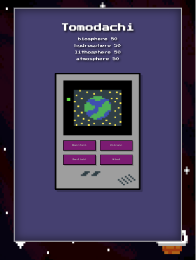

# Tomodachi

### Built With
  
 
 
  
  
 
 
 

## Description
Tomodachi is a creation simulation game developed by four budding developers in late 2021.  The game begins with the player naming their planet.  Once the player establishes their planet they then interact with the planet's Biospheres through four interactions: Rainfall, Volcano, Sunlight, and Wind.  To win the game, the user must create a balanced bio system where the planet is ready to sustain life.  But, watch out! Too little or too much of an interaction can easily thwart an emerging planet into another planet altogether!  Play Tomodachi and see what you can create! 

## Table of Contents
* [ScreenShot](#Screenshot)
* [Deployed Site](#Deployedsite)
* [Future Development](#Futuredevelopment)
* [Contributors](#Contributors)
* [GitHub](#GitHub)
* [License](#License)

## ScreenShot

## Deployed Site

## GitHub 
* GitHub: (https://github.com/Johnson90cm/Tomodachi)

## Contributors
* [Taylor Hakes](https://github.com/sadboitay)
* [Aimee Forbush](https://github.com/aeforbush)
* [Colton Johnson](https://github.com/johnson90cm)
* [Michael Heinhold](https://github.com/michaelheinhold)
* [Sheldon Collins](https://github.com/sunrisedad)

## License

